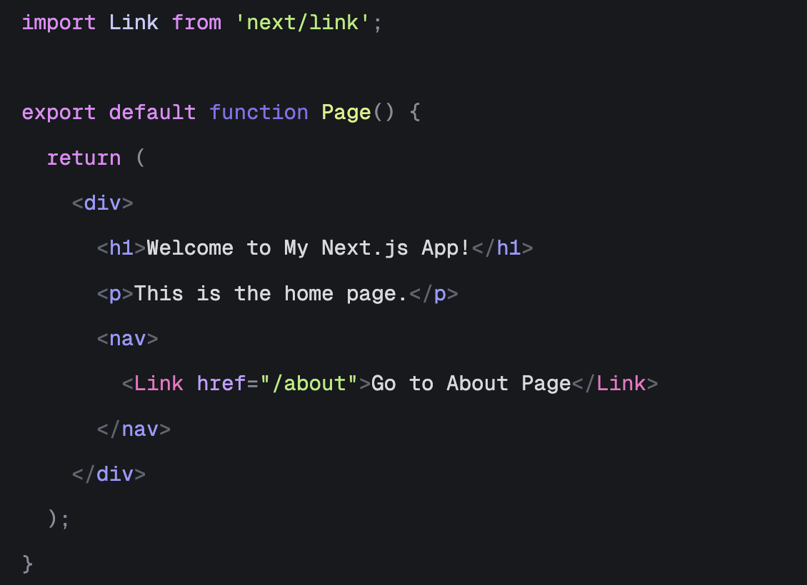

# Trigger Dark Refined

A sleek, modern dark theme for Visual Studio Code inspired by Trigger aesthetics.

## Preview
## Screenshots

### JavaScript / TypeScript

### Python

### HTML/CSS

## Installation

### Via VS Code Marketplace

1. Open Visual Studio Code
2. Go to Extensions (Ctrl+Shift+X or Cmd+Shift+X)
3. Search for "Trigger Dark Refined"
4. Click Install

### Manual Installation

1. Download the `.vsix` file from the releases
2. Open VS Code
3. Press `Ctrl+Shift+P` (or `Cmd+Shift+P` on macOS)
4. Type "Extensions: Install from VSIX..."
5. Select the downloaded `.vsix` file

## Activation

1. Open VS Code
2. Go to File → Preferences → Color Theme (or use `Ctrl+K Ctrl+T`)
3. Select "Trigger Dark" from the list

## Features

- 🎨 **Modern Dark Theme**: Carefully crafted dark color palette
- 👁️ **Eye-friendly**: Reduced eye strain with optimal contrast ratios
- 🔧 **Syntax Highlighting**: Enhanced syntax highlighting for better code readability
- 📝 **Editor Support**: Optimized for popular programming languages
- 🎯 **Focus Mode**: Clean interface that helps you focus on code

## Supported Languages

This theme provides enhanced syntax highlighting for:

- Go [✅]
- JavaScript/TypeScript [✅]
- Python [✅]
- HTML/CSS [✅]
- JSON [✅]
- Markdown [✅]
- YAML [✅]
- Shell Script [✅]
- Java [❌]
- C/C++ [❌]
- Ruby [❌]
- PHP [❌]
- Swift [❌]
- Rust [❌]
- Kotlin [❌]
- Dart [❌]
- SQL [❌]
- R [❌]
- Lua [❌]. 

 
More languages will be supported in future updates!

## Contributing

Contributions are welcome! If you have suggestions for improvements or find any issues:

1. Fork this repository
2. Create a feature branch (`git checkout -b feature/amazing-feature`)
3. Commit your changes (`git commit -m 'Add some amazing feature'`)
4. Push to the branch (`git push origin feature/amazing-feature`)
5. Open a Pull Request

## Issues & Feedback

If you encounter any issues or have suggestions, please:

- Open an issue on [GitHub](https://github.com/yourusername/trigger-dark-refined/issues)
- Provide screenshots if possible
- Include your VS Code version and operating system

## Changelog

See [CHANGELOG.md](CHANGELOG.md) for details about changes in each version.

## License

This project is licensed under the MIT License - see the [LICENSE](LICENSE) file for details.

## Acknowledgments

- Inspired by modern dark themes
- Thanks to the VS Code community for feedback and suggestions
- Built with ❤️ for developers

---

**Enjoy coding with Trigger Dark Refined!** ⚡